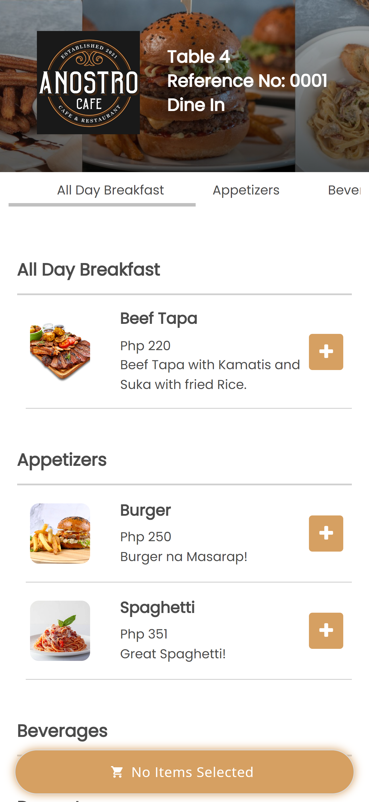
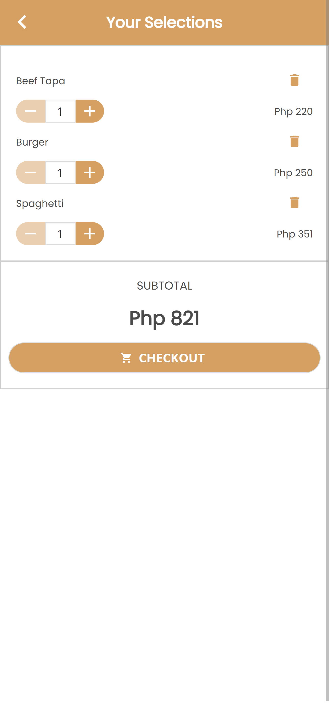
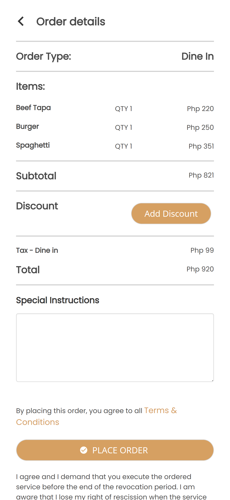
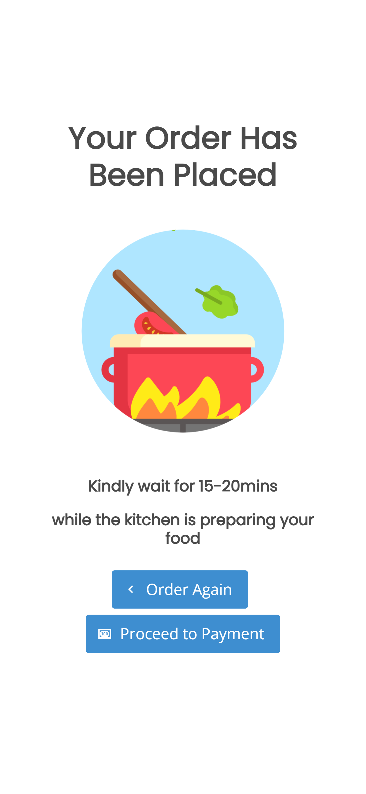
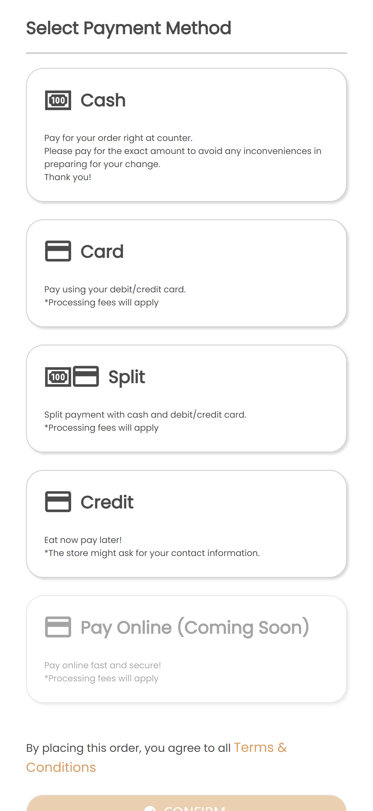
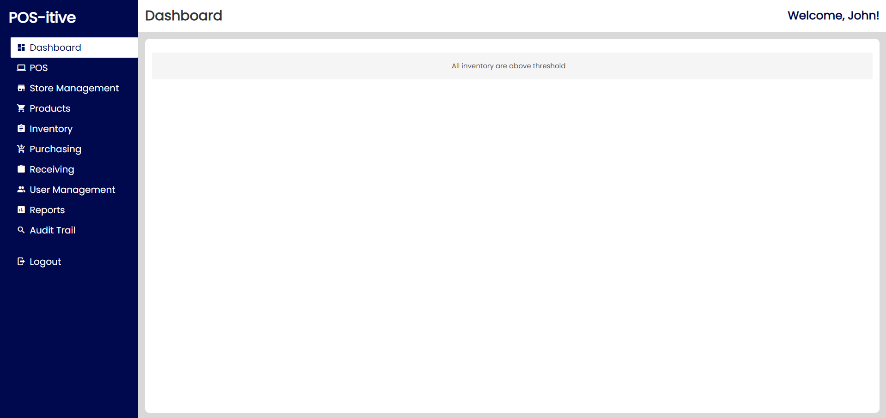
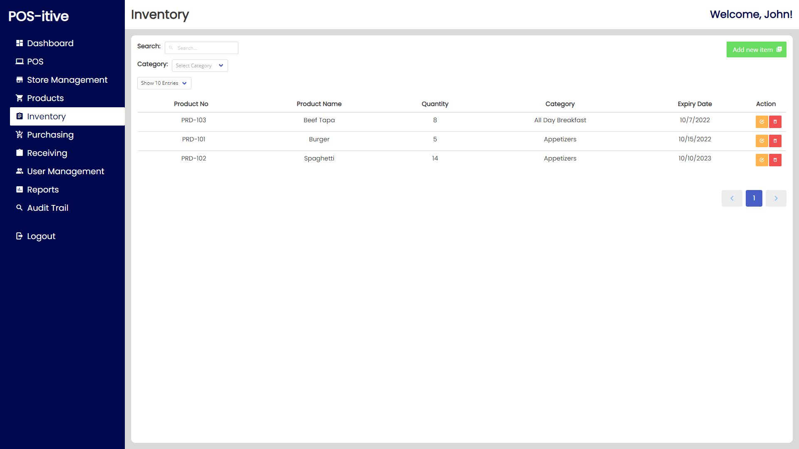
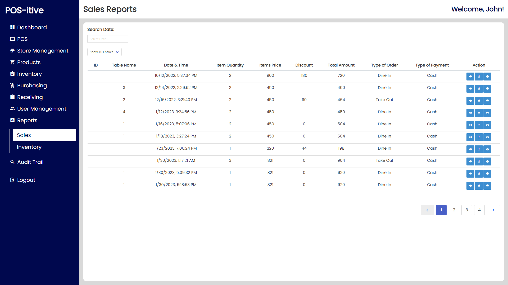

# 🌟 Business Management System 🌟


A comprehensive solution designed to manage and streamline various aspects of business operations, including inventory management, customer relations, employee management, and sales tracking. This system aims to provide businesses with an intuitive and efficient way to handle their daily operations.

## 🚀 Table of Contents
- [✨ Features](#-features)
- [🛠️ Technologies](#️-technologies)
- [📦 Installation](#-installation)
- [📝 Usage](#-usage)
- [📸 Screenshots](#-screenshots)
- [🤝 Contributing](#-contributing)
- [📜 License](#-license)
- [📞 Contact](#-contact)

## ✨ Features
- 🏷️ **Inventory Management**: Track and manage products, supplies, and inventory levels.
- 🧑‍🤝‍🧑 **Customer Management**: Maintain customer information and transaction history.
- 👨‍💼 **Employee Management**: Manage employee profiles, roles, and permissions.
- 💸 **Sales Tracking**: Monitor sales, generate invoices, and analyze sales data.
- 🛒 **POS for Customer Orders**: Efficiently manage customer orders with a point-of-sale system, designed for easy checkout and tracking.
- 📋 **Customer Menu**: User-friendly menu interface for customers to browse products, place orders, and view order details.
- 📊 **Reports**: Generate reports for sales, inventory, and employee performance.
- 🖥️ **User-Friendly Interface**: Simple and intuitive UI for easy navigation.

## 🛠️ Technologies
The Business Management System is built with the following technologies:
- **Frontend**: VueJS, HTML, CSS, JavaScript, Buefy
- **Backend**: Node.js, Express.js
- **Database**: MySQL 
- **Authentication**: JSON Web Tokens (JWT)
- **Version Control**: Git, GitHub

## 📦 Installation

To run this project locally, follow these steps:

1. **Clone the repository**:
    ```bash
    git clone https://github.com/Mondreal777/business-management-system.git
    cd business-management-system
    ```

2. **Install dependencies for the client**:
    ```bash
    cd client
    npm install
    ```

3. **Install dependencies for the server**:
    ```bash
    cd ../server
    npm install
    ```

4. **Configure Environment Variables**:
    Create a `.env` file in the `server` directory with the following content:
    ```
    PORT=5000
    MONGODB_URI=your_mongodb_connection_string
    JWT_SECRET=your_jwt_secret
    ```

5. **Run the Application**:
    Open two terminals:
    - **Terminal 1**: Start the client
      ```bash
      cd client
      npm run serve
      ```
    - **Terminal 2**: Start the server
      ```bash
      cd server
      npm npm run dev
      ```

6. **Access the Application**:
    The application should now be running on:
    - Frontend: `http://localhost:8081`
    - Backend: `http://localhost:8085`

## 📝 Usage
- **Login**: Create an account or log in using existing credentials.
- **Dashboard**: View an overview of your business metrics.
- **POS for Customer Orders**: Use the point-of-sale system to process customer orders quickly and efficiently.
- **Customer Menu**: Allow customers to browse available products, place orders, and check order statuses.
- **Manage Inventory**: Add, update, or remove products from your inventory.
- **Customer Management**: Track customer details and transaction history.
- **Sales**: Record sales transactions and generate invoices.
- **Reports**: Generate and view detailed reports on business operations.

## 📸 Screenshots












## 🤝 Contributing
Contributions are welcome! Please follow these steps:
1. **Fork the project**
2. **Create your feature branch** (`git checkout -b feature/your-feature`)
3. **Commit your changes** (`git commit -m 'Add some feature'`)
4. **Push to the branch** (`git push origin feature/your-feature`)
5. **Open a pull request**

## 📜 License
This project is licensed under the MIT License - see the [LICENSE](LICENSE) file for details.

## 📞 Contact
For any questions or feedback, please reach out to:
- **Earlmond Ross** - [mondreal777](https://github.com/Mondreal777)

---

> ⭐️ **Thank you for checking out the Business Management System! If you like this project, please give it a star!** ⭐️
